# Analog Function Generator

<figure>
  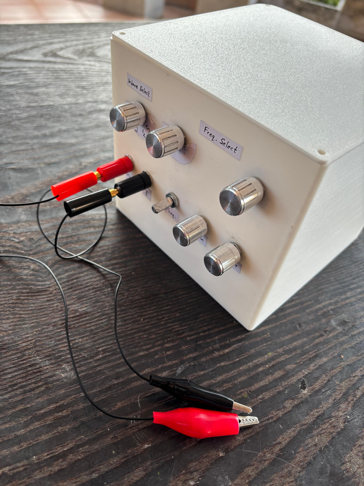
  <figcaption>Complete assembly of the Analog Function Generator.</figcaption>
</figure>

## Project Overview
A precise analog function generator capable of generating multiple waveforms in a wide range of frequencies. This is an ideal device for electronics enthusiasts to obtain various waveforms they may need.

### Features
- **Waveforms:** Sine, Square, PWM, Triangle, Sawtooth
- **Amplitude:** Adjustable 0-10V output
- **Frequency Range:** 20Hz to 20,000Hz
- **Design:** Built with analog components only.

## Circuit Diagram
<figure>
  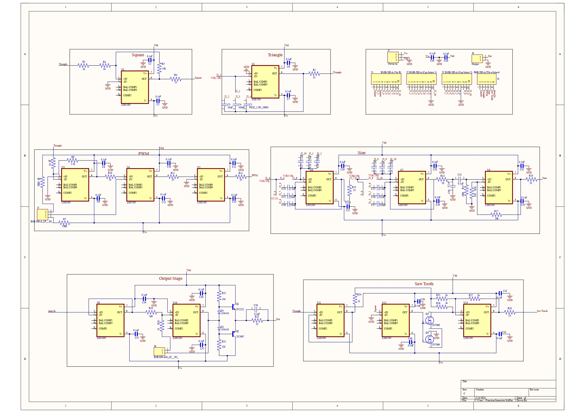
  <figcaption>Schematic diagram of the PCB.</figcaption>
</figure>

## Components
- **Resistors:** 
- **Capacitors:** 
- **Op-Amps:** LM318n
- **Potentiometers:** For adjusting amplitude, frequency, and PWM duty cycle
- **Power Supply:** +/- 12V DC

## How It Works
The function generator runs on a schmitt trigger oscillator, which uses hysteresis to generate triangle and square waves. These waves are then filtered, amplified, and compared to produce sine, pwm, and sawtooth waveforms.

## PCB
<figure>
  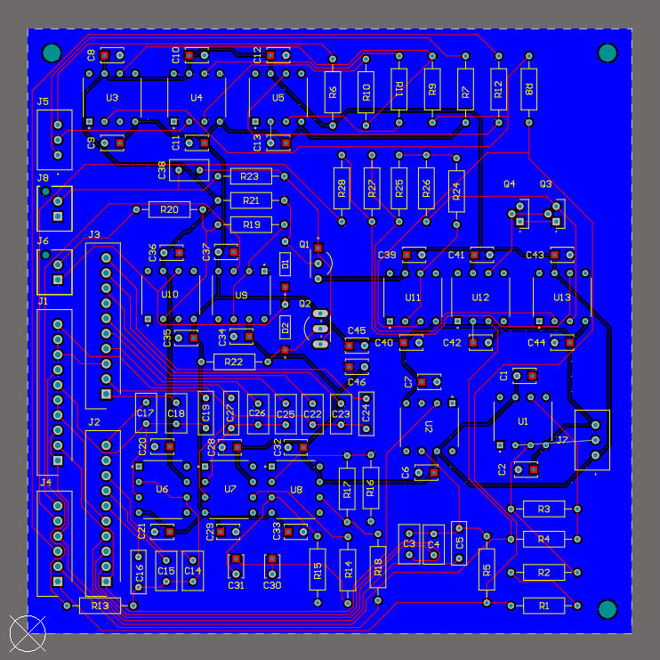
  <figcaption>Photograph of the PCB layout.</figcaption>
</figure>

## Setup & Usage
1. **Build the Circuit:** Construct the function generator on a PCB or a breadboard, and connect the relevant components.
2. **Power the Circuit:** Connect the +/-12V DC power supply.
3. **Select Waveform:** Select the desired waveform using the selector switch.
4. **Adjust Amplitude, Frequency & PWM Duty cycle:** Select the desired output frequency, amplitude, and PWM duty cycle using the relevant potentiometers and switches.
5. **Connect to Oscilloscope:** Connect to an oscilloscope and verify the output.

## Output Results
<figure>
  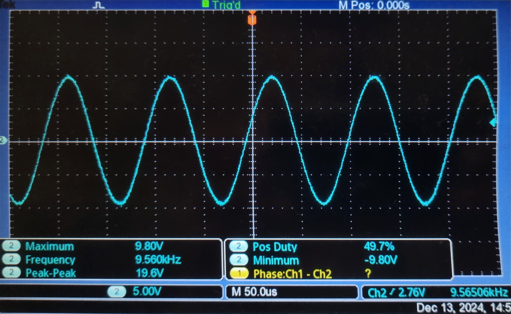
  <figcaption>Output sine waveform at 10kHz and 10V.</figcaption>
</figure>

<figure>
  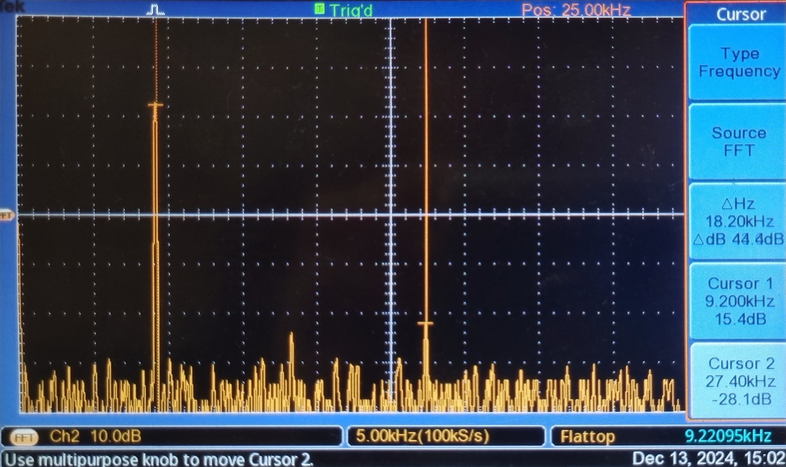
  <figcaption>FFT of the sine waveform showing its frequency spectrum.</figcaption>
</figure>

<figure>
  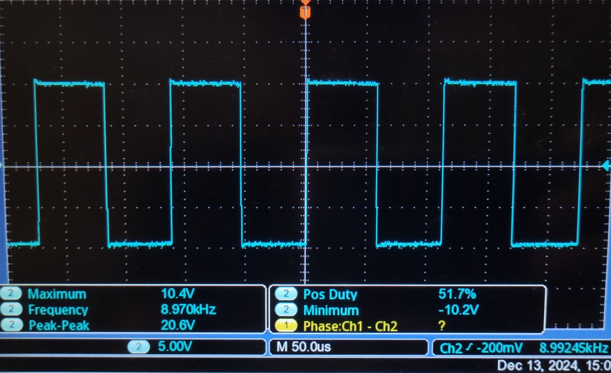
  <figcaption>Output square waveform at 10kHz and 10V.</figcaption>
</figure>

<figure>
  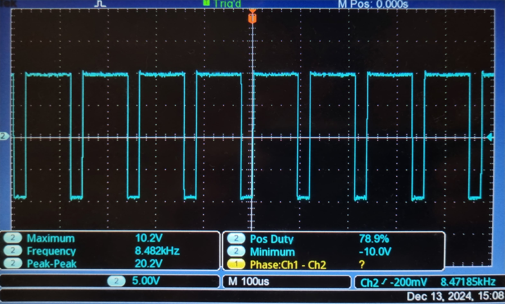
  <figcaption>Output PWM waveform with 80% duty cycle at 10kHz.</figcaption>
</figure>

<figure>
  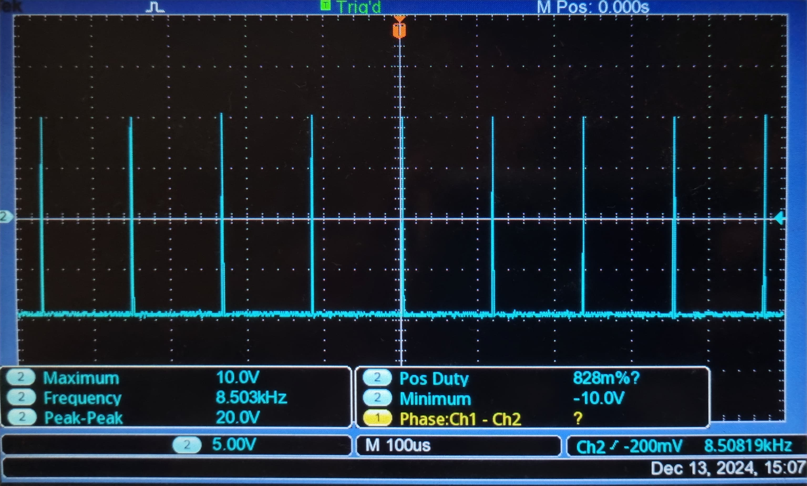
  <figcaption>Output PWM waveform with 1% duty cycle at 10kHz.</figcaption>
</figure>

<figure>
  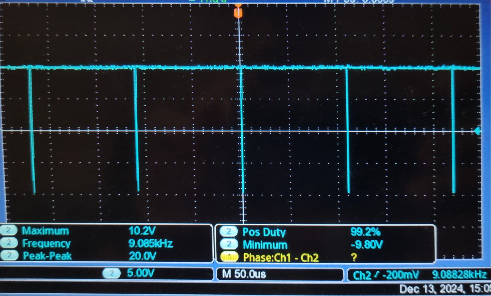
  <figcaption>Output PWM waveform with 99% duty cycle at 10kHz.</figcaption>
</figure>

<figure>
  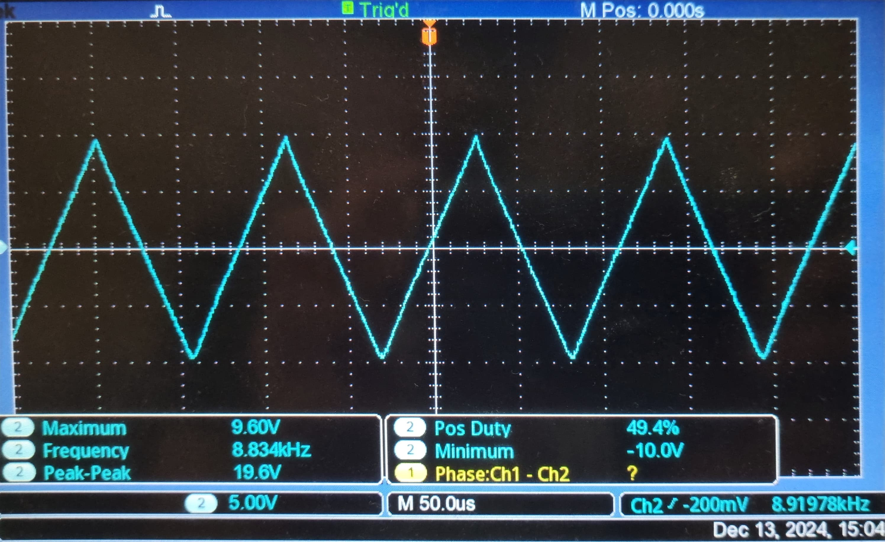
  <figcaption>Output triangle waveform at 10kHz and 10V.</figcaption>
</figure>

<figure>
  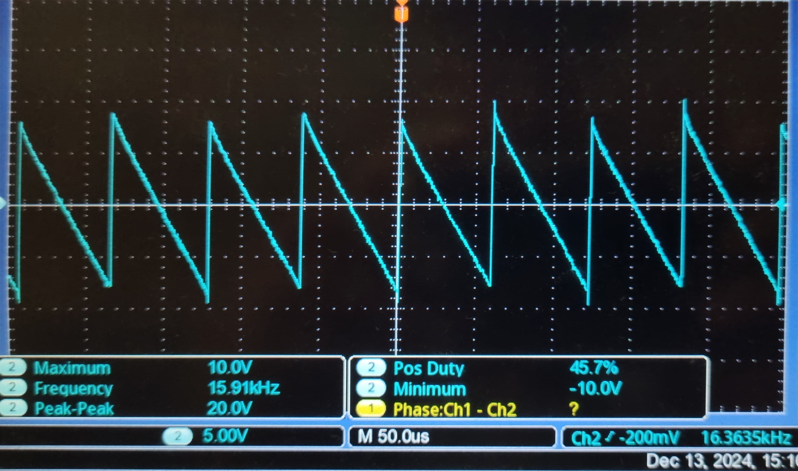
  <figcaption>Output sawtooth waveform at 10kHz and 10V.</figcaption>
</figure>

## Challenges Faced
- **Stability:** Maintaining stability and symmetry across the entire range for the sawtooth waveform.
- **Component Selection:** Selecting readily available components that met the performance requirements of our design.
- **Variable Cut-Off Filter:** Creating a filter that would vary its cut-off, in tune with the frequency of the oscillator.

## Future Improvements
- **Extended Frequency Range:** Increase the stability at higher frequencies.
- **Improved Output Stage:** Redesigning the output stage to be able to drive smaller loads.
